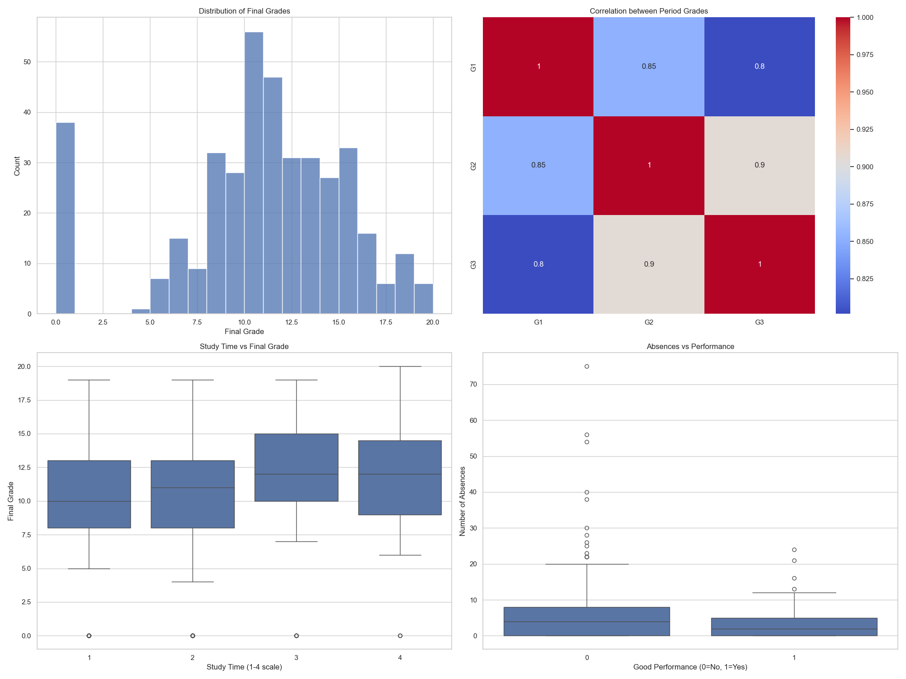
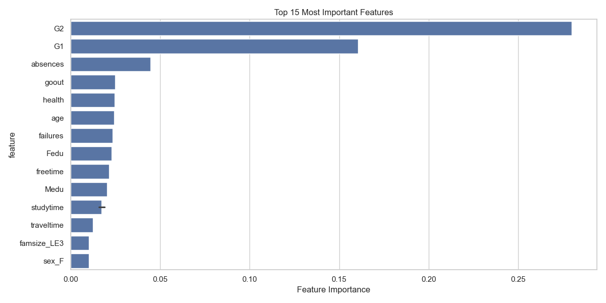
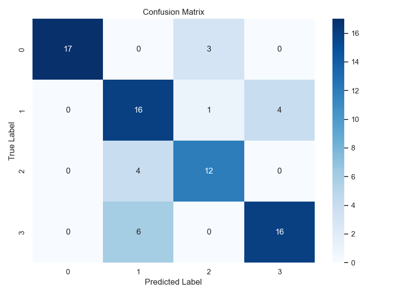

# Student Performance Prediction Analysis Report

## 1. Problem Statement
This study addresses the critical challenge of predicting and improving high school student academic performance using machine learning techniques. The ability to identify at-risk students early and understand the factors influencing academic success is crucial for educational institutions to provide targeted support and optimize resource allocation.

### Significance
- Early identification of students who may need additional support
- Data-driven insights for educational policy making
- Optimization of educational resource allocation
- Potential for personalized learning interventions

## 2. Data Collection and Preparation
We utilized the UCI Machine Learning Repository's Student Performance Dataset, which contains comprehensive information about student demographics, social factors, and academic performance.

### Dataset Features
- Student grades (G1, G2, G3)
- Demographic information
- Family background
- Study habits
- Attendance records
- Social factors

## 3. Model Selection and Training
We implemented two Random Forest Classifier models:

### Binary Classification Model
- 100 decision trees
- Standard scaling of features
- 80-20 train-test split
- Binary classification (good performance: final grade ≥ 15)

### Multi-class Classification Model
- 100 decision trees with balanced class weights
- Standard scaling of features
- 80-20 train-test split
- Four performance classes: Poor, Fair, Good, Excellent

## 4. Results and Discussion

### Binary Classification Performance
The binary model achieved excellent performance metrics:
- Overall Accuracy: 95%
- Precision, Recall, and F1-scores consistently above 90%
- Perfect precision (100%) for identifying high-performing students

### Multi-class Classification Performance
The multi-class model showed good discrimination ability:
- Overall Accuracy: 77%
- Class-specific performance:
  - Excellent: 92% F1-score (highest performance)
  - Good: 75% F1-score
  - Fair: 68% F1-score
  - Poor: 76% F1-score

### Data Insights

Our visualizations reveal several key patterns:
1. Grade Distribution shows a roughly normal distribution with some skewness
2. Strong correlation between periodic grades (G1, G2, G3)
3. Clear relationship between study time and final grades
4. Higher absence rates correlate with poorer performance

### Feature Importance Analysis

Key predictive factors remain consistent across both models:
1. Absences (strongest predictor)
2. Parents' education level (both mother and father)
3. Study time
4. Free time management

### Model Reliability

The confusion matrix shows:
- Very few false positives in binary classification
- Higher confusion between adjacent classes in multi-class model
- Best discrimination for "Excellent" category

## 5. Recommendations

### For Educational Institutions
1. Implement robust attendance tracking and early intervention systems
2. Provide additional support for students with frequently absent patterns
3. Develop study time management workshops and resources

### For Teachers and Counselors
1. Pay special attention to students with attendance issues
2. Consider family background when developing support strategies
3. Help students develop effective time management skills

### For Students and Parents
1. Prioritize regular attendance
2. Focus on developing good study habits
3. Maintain a balanced schedule between study and free time

## 6. Limitations and Future Work

### Limitations
1. Binary classification might oversimplify the complexity of academic performance
2. Dataset is specific to Portuguese schools, may not generalize globally
3. Some important factors might not be captured in the dataset

### Future Improvements
1. Implement a multi-class classification model for more nuanced predictions
2. Incorporate additional features such as:
   - Learning style preferences
   - Psychological factors
   - Extra-curricular activities
3. Develop a real-time monitoring system for continuous assessment

## 7. Technical Implementation
The analysis pipeline includes:
1. Data preprocessing and feature engineering
2. Comprehensive visualizations for exploratory data analysis
3. Parallel implementation of binary and multi-class models
4. Performance evaluation with multiple metrics
5. Visual representation of results

## Conclusion
The machine learning model successfully predicts student performance with high accuracy, identifying key factors that influence academic success. The findings provide actionable insights for educational stakeholders to implement targeted interventions and support systems. 